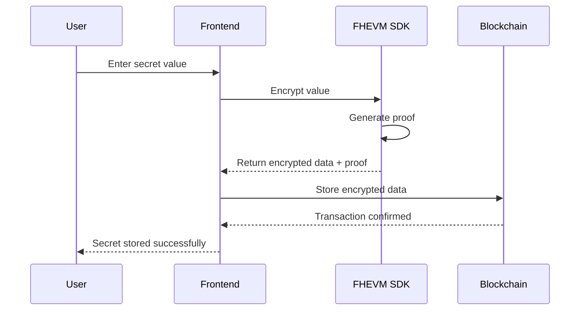
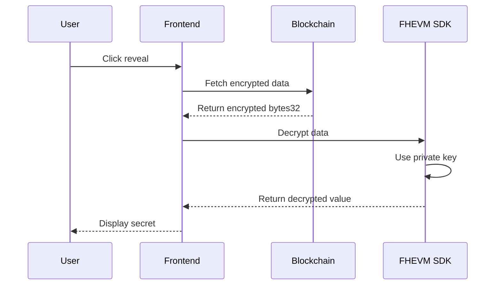

# FHE Secret Vault 🔐

A decentralized application for storing encrypted secrets on-chain using Fully Homomorphic Encryption (FHE) powered by Zama's FHEVM.

## 🌟 Overview

FHE Secret Vault is a privacy-preserving vault that allows users to store sensitive information (PINs, passwords, recovery codes) on the Ethereum blockchain while keeping them completely encrypted. Using Fully Homomorphic Encryption from Zama's FHEVM, secrets remain encrypted on-chain and can only be decrypted by their owner.

watch the video. here

- [watch the video](https://www.loom.com/share/9717c223ce8b4f5aa1d0df6053d92db0)

### Key Features

- ✅ **End-to-End Encryption**: Secrets encrypted client-side before blockchain storage
- ✅ **Privacy-Preserving**: Only secret owners can decrypt their data
- ✅ **Multiple Secrets**: Store unlimited secrets with descriptive labels
- ✅ **On-Chain Storage**: Immutable and censorship-resistant
- ✅ **User-Friendly Interface**: Modern React UI with Web3 integration
- ✅ **Sepolia Testnet**: Ready for testing with real FHEVM functionality

## 📋 Table of Contents

- [Architecture](#architecture)
- [Prerequisites](#prerequisites)
- [Quick Start](#quick-start)
- [Project Structure](#project-structure)
- [Smart Contract](#smart-contract)
- [Frontend Application](#frontend-application)
- [How It Works](#how-it-works)
- [Security Model](#security-model)
- [Development](#development)
- [Deployment](#deployment)
- [Testing](#testing)
- [API Reference](#api-reference)
- [Contributing](#contributing)
- [License](#license)
- [watch the video](https://www.loom.com/share/9717c223ce8b4f5aa1d0df6053d92db0)

## 🏗️ Architecture

```
┌─────────────────────────────────────────────────────────┐
│                    User Interface (React)                │
│  - Wallet Connection  - Secret Management  - Encryption  │
└───────────────────────┬─────────────────────────────────┘
                        │
                        ▼
┌─────────────────────────────────────────────────────────┐
│              FHEVM SDK (Client-Side)                     │
│  - Public Encryption  - Decryption  - Key Management     │
└───────────────────────┬─────────────────────────────────┘
                        │
                        ▼
┌─────────────────────────────────────────────────────────┐
│          Ethereum Blockchain (Sepolia)                   │
│  ┌─────────────────────────────────────────────┐        │
│  │      SecretVault Smart Contract             │        │
│  │  - Encrypted Storage  - Access Control      │        │
│  └─────────────────────────────────────────────┘        │
└─────────────────────────────────────────────────────────┘
```

### Technology Stack

**Smart Contract:**

- Solidity ^0.8.24
- FHEVM by Zama
- Hardhat/Foundry for development

**Frontend:**

- React 18+ with TypeScript
- ethers.js v5/v6
- FHEVM SDK (CDN)
- TailwindCSS
- Vite

**Infrastructure:**

- Sepolia Testnet
- MetaMask for wallet connection
- Infura/Alchemy RPC endpoints

## 📦 Prerequisites

Before you begin, ensure you have:

- **Node.js** 16.x or higher
- **npm** or **yarn** package manager
- **Git** for version control
- **MetaMask** browser extension
- **Sepolia ETH** (get from [Sepolia Faucet](https://sepoliafaucet.com))

### Development Tools

```bash
# Install Hardhat (for smart contract development)
npm install --save-dev hardhat

# Or use Foundry
curl -L https://foundry.paradigm.xyz | bash
foundryup
```

## 🚀 Quick Start

### 1. Clone the Repository

```bash
git clone https://github.com/yourusername/fhe-secret-vault.git
cd fhe-secret-vault
```

### 2. Install Dependencies

```bash
# Install root dependencies
npm install

# Install smart contract dependencies
cd contracts
npm install

# Install frontend dependencies
cd ../frontend
npm install
```

### 3. Configure Environment

Create `.env` files in both `contracts/` and `frontend/` directories:

**contracts/.env:**

```env
PRIVATE_KEY=your_wallet_private_key
SEPOLIA_RPC_URL=https://sepolia.infura.io/v3/YOUR_INFURA_KEY
ETHERSCAN_API_KEY=your_etherscan_api_key
```

**frontend/.env:**

```env
VITE_CONTRACT_ADDRESS_SEPOLIA=0xYourDeployedContractAddress
VITE_SEPOLIA_RPC_URL=https://sepolia.infura.io/v3/YOUR_INFURA_KEY
VITE_CHAIN_ID=11155111
```

### 4. Deploy Smart Contract

```bash
cd contracts

# Compile contracts
npx hardhat compile

# Deploy to Sepolia
npx hardhat run scripts/deploy.js --network sepolia

# Verify on Etherscan (optional)
npx hardhat verify --network sepolia DEPLOYED_CONTRACT_ADDRESS
```

### 5. Start Frontend

```bash
cd frontend

# Start development server
npm run dev

# Open http://localhost:5173 in your browser
```

### 6. Connect & Test

1. Open the app in your browser
2. Click "Connect" to link your MetaMask wallet
3. Switch to Sepolia network if prompted
4. Store your first encrypted secret!

## 📁 Project Structure

```
fhe-secret-vault/
├── contracts/                  # Smart contract source code
│   ├── src/
│   │   └── SecretVault.sol    # Main vault contract
│   ├── test/
│   │   └── SecretVault.test.js
│   ├── scripts/
│   │   └── deploy.js          # Deployment script
│   ├── hardhat.config.js
│   └── package.json
│
├── frontend/                   # React frontend application
│   ├── src/
│   │   ├── components/
│   │   │   └── SecretVaultUI.tsx
│   │   ├── lib/
│   │   │   ├── fhevm.ts       # FHEVM initialization
│   │   │   └── encryption.ts  # Encryption utilities
│   │   ├── App.tsx
│   │   ├── App.css
│   │   └── main.tsx
│   ├── public/
│   ├── index.html
│   ├── vite.config.ts
│   └── package.json
│
├── docs/                       # Additional documentation
│   ├── CONTRACT.md            # Smart contract details
│   ├── FRONTEND.md            # Frontend guide
│   └── SECURITY.md            # Security considerations
│
├── .gitignore
├── README.md                  # This file
└── LICENSE
```

## 📜 Smart Contract

### Core Functions

#### Store Secret

```solidity
function storeSecret(
    externalEuint32 encryptedSecret,
    bytes calldata inputProof,
    string calldata label
) external payable
```

Store a new encrypted secret with a descriptive label.

#### Retrieve Secret

```solidity
function getSecret(uint256 secretId)
    external view returns (bytes32 encryptedData)
```

Get encrypted data for client-side decryption.

#### Get Secret Info

```solidity
function getSecretInfo(uint256 secretId)
    external view returns (
        string memory label,
        uint256 createdAt,
        bool exists
    )
```

Retrieve non-encrypted metadata.

#### List Secrets

```solidity
function getActiveSecrets()
    external view returns (uint256[] memory activeSecretIds)
```

Get all active secret IDs for the caller.

#### Update Secret

```solidity
function updateSecret(
    uint256 secretId,
    externalEuint32 encryptedSecret,
    bytes calldata inputProof
) external
```

Update an existing secret with new encrypted data.

#### Delete Secret

```solidity
function deleteSecret(uint256 secretId) external
```

Permanently remove a secret from storage.

### Storage Fee

- Default: **0.001 ETH** per secret
- Prevents spam and abuse
- Owner can adjust via `setStorageFee()`

### Events

```solidity
event SecretStored(address indexed user, uint256 indexed secretId, string label, uint256 timestamp);
event SecretUpdated(address indexed user, uint256 indexed secretId, uint256 timestamp);
event SecretDeleted(address indexed user, uint256 indexed secretId, uint256 timestamp);
event StorageFeeChanged(uint256 newFee);
event FeesWithdrawn(address indexed to, uint256 amount);
```

## 💻 Frontend Application

### Key Components

#### Wallet Connection

- MetaMask integration
- Network detection and switching
- Account management

#### Secret Management

- Store new encrypted secrets
- View secret list with metadata
- Reveal/hide decrypted values
- Delete secrets

#### Encryption Flow

```typescript
// 1. Encrypt value client-side
const { encryptedData, inputProof } = await encryptUint32(
  secretValue,
  contractAddress,
  userAddress
);

// 2. Store on blockchain
const tx = await contract.storeSecret(encryptedData, inputProof, label, {
  value: storageFee,
});

await tx.wait();
```

#### Decryption Flow

```typescript
// 1. Fetch encrypted data
const encryptedData = await contract.getSecret(secretId);

// 2. Decrypt client-side
const decryptedValue = await decryptUint32(
  encryptedData,
  contractAddress,
  userAddress
);
```

### UI Features

- 🎨 Modern glassmorphism design
- 🌙 Dark mode optimized
- 📱 Responsive layout
- ⚡ Real-time status updates
- 🔔 Transaction notifications
- 🔄 Auto-refresh capability

## 🔒 How It Works

### 1. Encryption Process



### 2. Decryption Process



### 3. Data Flow

**Storage:**

```
Plain Text (1234) →
FHEVM Encryption →
Encrypted Data (0x...) →
Smart Contract Storage →
Blockchain
```

**Retrieval:**

```
Blockchain →
Smart Contract →
Encrypted Data (0x...) →
FHEVM Decryption →
Plain Text (1234)
```

## 🛡️ Security Model

### Encryption Security

- **Algorithm**: Fully Homomorphic Encryption (FHE) by Zama
- **Key Management**: Private keys never leave user's wallet
- **Client-Side**: All encryption/decryption happens in browser
- **Zero-Knowledge**: Contract never sees plain text values

### Access Control

- **Owner-Only**: Secrets can only be decrypted by their creator
- **Immutable Ownership**: Cannot transfer secret ownership
- **Permission System**: FHEVM `allow()` function controls access

### Best Practices

1. ✅ **Never log decrypted values** in production
2. ✅ **Validate all inputs** before encryption
3. ✅ **Use HTTPS** in production environments
4. ✅ **Verify contract addresses** before transactions
5. ✅ **Clear sensitive data** from memory after use
6. ✅ **Audit smart contracts** before mainnet deployment

### Known Limitations

- **Storage Limit**: uint32 max value (4,294,967,295)
- **Gas Costs**: FHE operations are more expensive than plain operations
- **Browser Support**: Requires modern browsers with WebAssembly
- **Network**: Currently Sepolia testnet only

## 🔧 Development

### Smart Contract Development

```bash
cd contracts

# Compile contracts
npx hardhat compile

# Run tests
npx hardhat test

# Run coverage
npx hardhat coverage

# Deploy locally
npx hardhat node
npx hardhat run scripts/deploy.js --network localhost
```

### Frontend Development

```bash
cd frontend

# Start dev server
npm run dev

# Build for production
npm run build

# Preview production build
npm run preview

# Run linter
npm run lint
```

### Environment Setup

**Hardhat Network (Local Testing):**

```javascript
// hardhat.config.js
module.exports = {
  networks: {
    hardhat: {
      chainId: 31337,
    },
  },
};
```

**Sepolia Testnet:**

```javascript
sepolia: {
  url: process.env.SEPOLIA_RPC_URL,
  accounts: [process.env.PRIVATE_KEY],
  chainId: 11155111
}
```

## 🚀 Deployment

### Smart Contract Deployment

#### 1. Prepare Deployment

```bash
cd contracts

# Ensure .env is configured
# Compile contracts
npx hardhat compile
```

#### 2. Deploy to Sepolia

```bash
npx hardhat run scripts/deploy.js --network sepolia
```

Expected output:

```
Deploying SecretVault...
SecretVault deployed to: 0x123...abc
Transaction hash: 0x456...def
```

#### 3. Verify Contract

```bash
npx hardhat verify --network sepolia DEPLOYED_ADDRESS
```

### Frontend Deployment

#### Deploy to Vercel

```bash
cd frontend

# Install Vercel CLI
npm i -g vercel

# Deploy
vercel

# Set environment variables in Vercel dashboard
```

#### Deploy to Netlify

```bash
# Install Netlify CLI
npm i -g netlify-cli

# Build
npm run build

# Deploy
netlify deploy --prod --dir=dist
```

#### Environment Variables

Set these in your deployment platform:

```
VITE_CONTRACT_ADDRESS_SEPOLIA=0x...
VITE_SEPOLIA_RPC_URL=https://sepolia.infura.io/v3/...
VITE_CHAIN_ID=11155111
```

### Production Checklist

- [ ] Contract deployed and verified on Etherscan
- [ ] Frontend deployed with HTTPS
- [ ] Environment variables configured
- [ ] Contract address updated in frontend
- [ ] Storage fee set appropriately
- [ ] Contract ownership verified
- [ ] Basic functionality tested
- [ ] Security audit completed (recommended)

## 🧪 Testing

### Smart Contract Tests

```bash
cd contracts
npx hardhat test
```

**Test Coverage:**

- ✅ Store secret with valid input
- ✅ Store secret with insufficient fee (should fail)
- ✅ Retrieve secret by owner
- ✅ Update existing secret
- ✅ Delete secret
- ✅ List active secrets
- ✅ Access control (non-owner cannot access)
- ✅ Storage fee adjustment (owner only)
- ✅ Fee withdrawal (owner only)

### Frontend Testing

**Manual Testing Checklist:**

- [ ] Connect wallet successfully
- [ ] Switch to Sepolia network
- [ ] FHEVM initializes (status: READY)
- [ ] Store a new secret
- [ ] View secret list
- [ ] Reveal encrypted secret
- [ ] Hide revealed secret
- [ ] Delete a secret
- [ ] Refresh secrets list
- [ ] Disconnect and reconnect wallet
- [ ] Handle rejected transactions
- [ ] Error messages display correctly

**Test Data:**

| Label     | Value      | Description      |
| --------- | ---------- | ---------------- |
| Test PIN  | 1234       | 4-digit PIN      |
| Bank Code | 987654     | 6-digit code     |
| Recovery  | 12345678   | 8-digit recovery |
| Max Value | 4294967295 | uint32 maximum   |

### Integration Testing

```bash
# Start local blockchain
npx hardhat node

# Deploy contract
npx hardhat run scripts/deploy.js --network localhost

# Start frontend with local contract
cd frontend
# Update .env with local contract address
npm run dev
```

## 📚 API Reference

### Smart Contract API

See [CONTRACT.md](./docs/CONTRACT.md) for detailed contract documentation.

### Frontend API

See [FRONTEND.md](./docs/FRONTEND.md) for frontend integration guide.

### Encryption API

#### `encryptUint32(value, contractAddress, userAddress)`

Encrypts a number for blockchain storage.

**Parameters:**

- `value`: number (0 to 4,294,967,295)
- `contractAddress`: string
- `userAddress`: string

**Returns:**

```typescript
Promise<{
  encryptedData: string;
  inputProof: string;
}>;
```

#### `decryptUint32(encryptedData, contractAddress, userAddress)`

Decrypts encrypted data from blockchain.

**Parameters:**

- `encryptedData`: string (bytes32)
- `contractAddress`: string
- `userAddress`: string

**Returns:** `Promise<number>`

## 🤝 Contributing

We welcome contributions! Please follow these steps:

1. **Fork the repository**
2. **Create a feature branch**
   ```bash
   git checkout -b feature/amazing-feature
   ```
3. **Commit your changes**
   ```bash
   git commit -m 'Add amazing feature'
   ```
4. **Push to the branch**
   ```bash
   git push origin feature/amazing-feature
   ```
5. **Open a Pull Request**

### Contribution Guidelines

- Follow existing code style
- Add tests for new features
- Update documentation
- Ensure all tests pass
- Use meaningful commit messages

### Code of Conduct

- Be respectful and inclusive
- Provide constructive feedback
- Focus on what is best for the community

## 📝 License

This project is licensed under the **BSD-3-Clause-Clear** License - see the [LICENSE](LICENSE) file for details.

## 🙏 Acknowledgments

- **Zama** - For FHEVM technology and SDK
- **Ethereum Foundation** - For blockchain infrastructure
- **OpenZeppelin** - For smart contract patterns
- **React Community** - For frontend framework

## 📞 Support & Resources

### Documentation

- [FHEVM Documentation](https://docs.zama.ai/fhevm)
- [Ethers.js Documentation](https://docs.ethers.org/v5/)
- [React Documentation](https://react.dev)

### Community

- [Zama Discord](https://discord.gg/zama)
- [GitHub Discussions](https://github.com/yourusername/fhe-secret-vault/discussions)
- [Issues](https://github.com/yourusername/fhe-secret-vault/issues)

### Get Testnet ETH

- [Sepolia Faucet](https://sepoliafaucet.com)

- [Alchemy Sepolia Faucet](https://sepoliafaucet.com)
- [Infura Sepolia Faucet](https://www.infura.io/faucet/sepolia)

## ❓ FAQ

**Q: Is my data really private on a public blockchain?**  
A: Yes! Your data is encrypted using FHE before being stored. Only you can decrypt it with your private key.

**Q: What happens if I lose my wallet?**  
A: Your encrypted secrets cannot be recovered without your wallet's private key. Always backup your wallet securely.

**Q: Can I share secrets with others?**  
A: Currently, no. Each secret can only be decrypted by its owner. Secret sharing is planned for Phase 2.

**Q: Why Sepolia only?**  
A: FHEVM is currently available on testnets. Mainnet support depends on Zama's roadmap.

**Q: How much does it cost?**  
A: Storage fee is 0.001 ETH + gas fees. On Sepolia testnet, use free test ETH.

**Q: Is this production-ready?**  
A: This is a testnet demonstration. Audit and additional testing required for production use.

## 📊 Project Stats

- **Smart Contract**: ~200 lines of Solidity
- **Frontend**: ~1000 lines of TypeScript/React
- **Dependencies**: FHEVM SDK, ethers.js, React
- **Network**: Sepolia Testnet
- **License**: BSD-3-Clause-Clear

---
